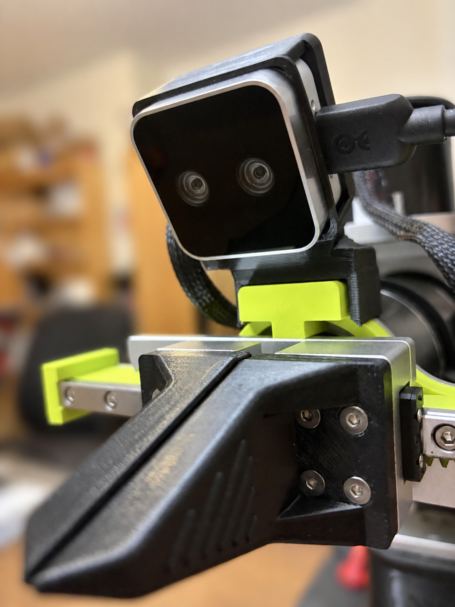
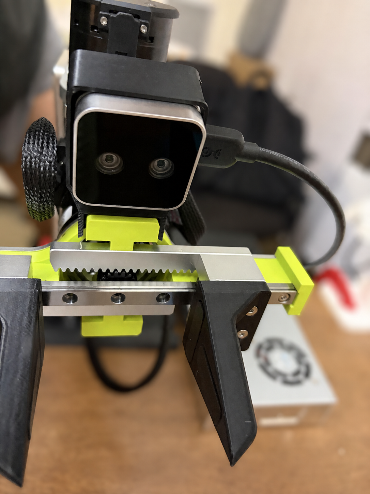
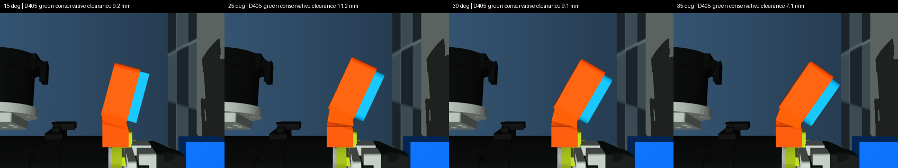
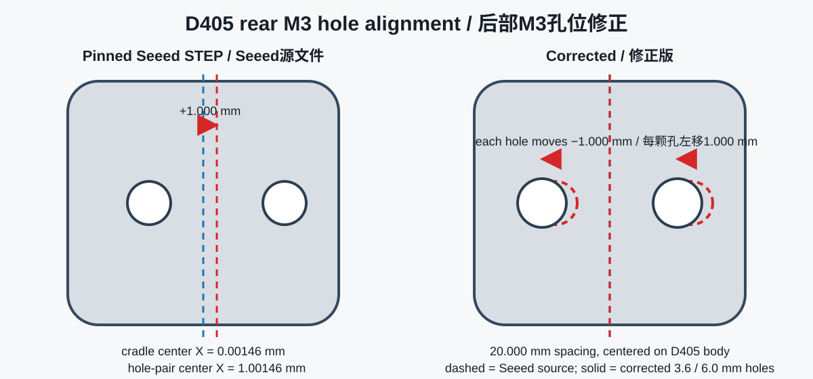
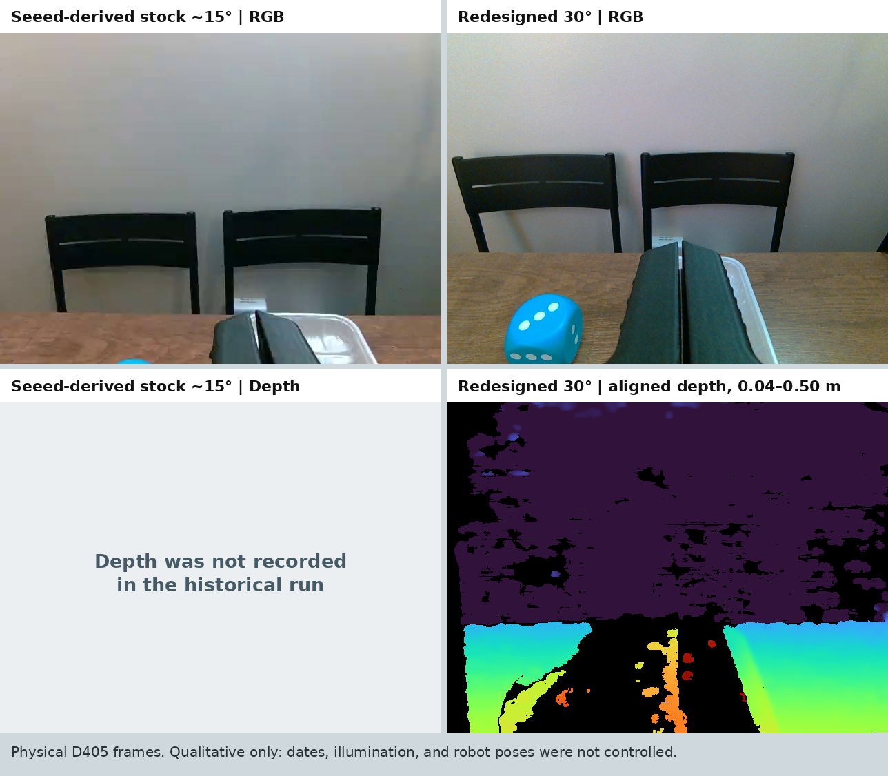
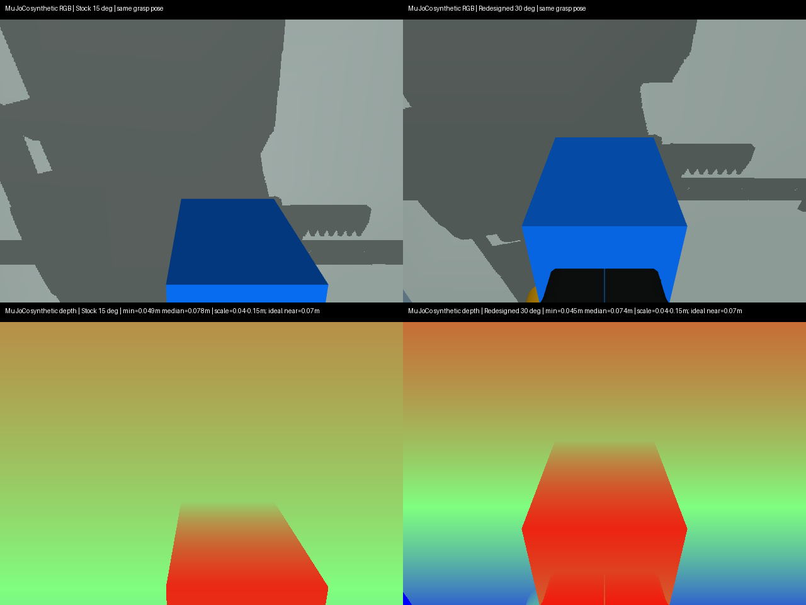
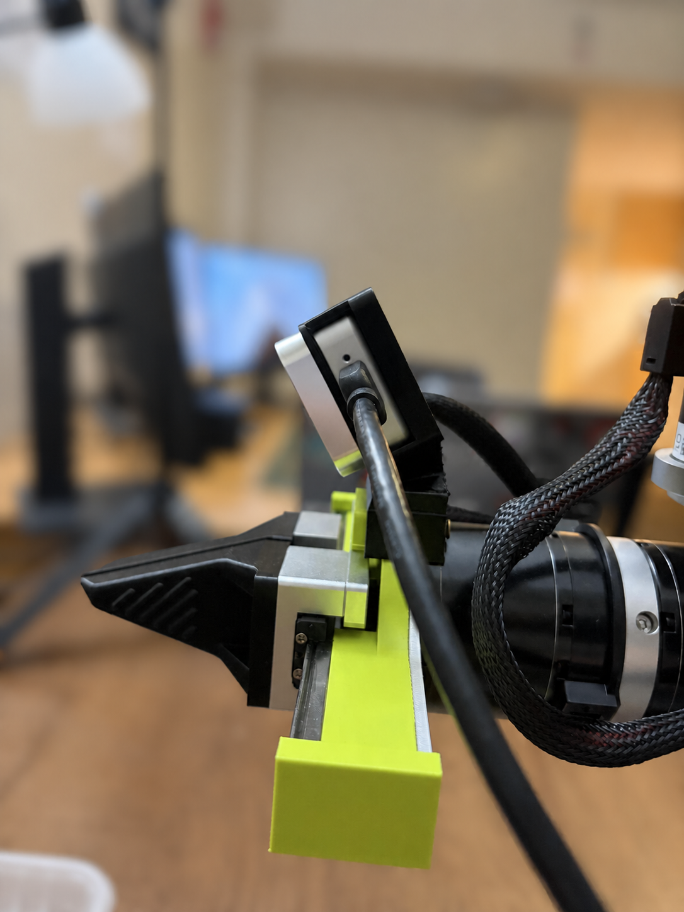
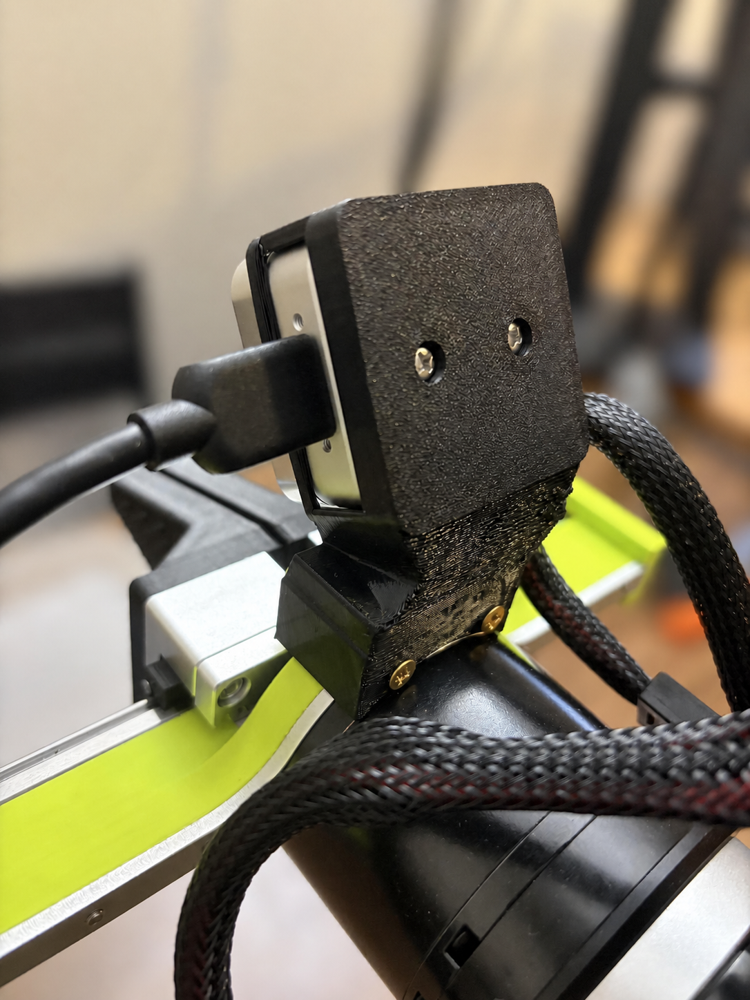
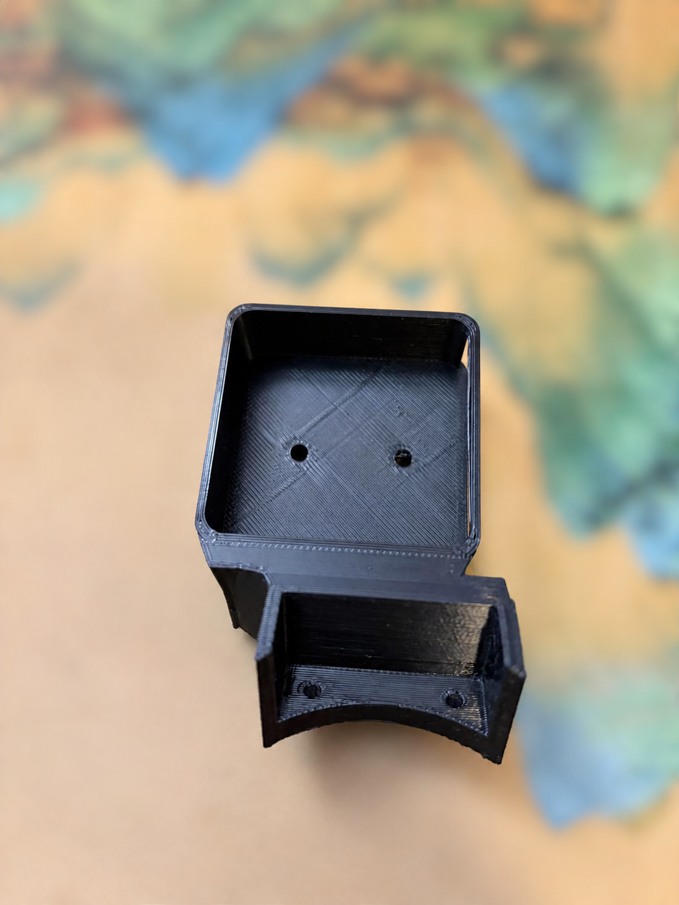
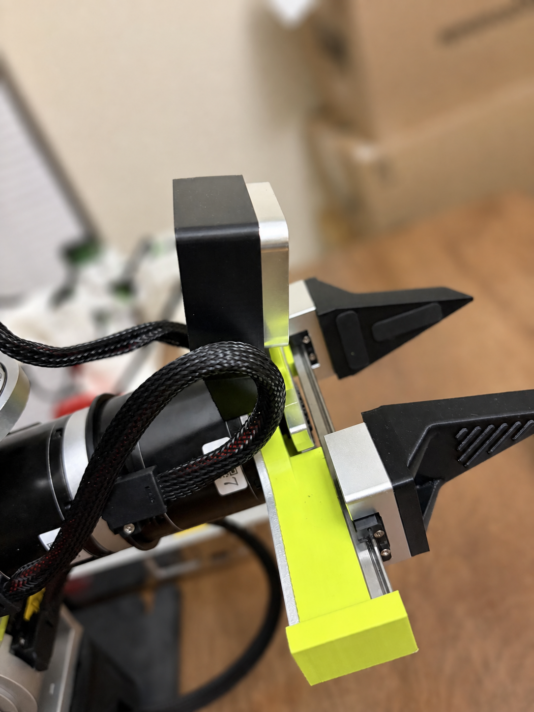

# reBot B601-RS RealSense D405 腕部相机支架

[English](README.md) · [STEP/STL](hardware/release/) · [设计论证](docs/design-rationale.zh-CN.md) · [验证](docs/validation.zh-CN.md) · [实拍图库](docs/photo-gallery.md)

<p align="center">
  
</p>

这是为 [Seeed reBot Arm B601-RS](https://github.com/Seeed-Projects/reBot-DevArm) 与 [RealSense D405](https://www.realsenseai.com/products/stereo-depth-camera-d405/) 专门设计的 **30° 固定俯角 eye-in-hand 开源支架**。

设计保留 Seeed 完整 D405 托架和 B601 腕部接口，再施加：

- **30° 固定俯角**：当前固定位置下同时满足间隙与工作距离边界的最大可行整数角；
- **横向平移9 mm**：让D405左成像器光学参考而不是铝壳中心对准夹爪中心；
- **向上补偿6 mm**：增大俯角时仍保留相机前下角的保守间隙；
- **实心放样过渡体**：填掉侧面凹口并建立较大承力路径；
- **不镜像、USB方向不变**。

> “最好”是指在明确 B601-RS 几何和约束下经过验证的**通用折中**，不是所有任务和姿态的数学全局最优。

## 原版与改造版外观

| Seeed派生原版约15° | 改造30° |
| --- | --- |
|  |  |

上游来源是 Seeed 在固定 commit [`590ff16c51099a15a34abb339c6364355fde9235`](https://github.com/Seeed-Projects/reBot-DevArm/tree/590ff16c51099a15a34abb339c6364355fde9235) 中的 [`D405_305_Mount.step`](https://github.com/Seeed-Projects/reBot-DevArm/blob/590ff16c51099a15a34abb339c6364355fde9235/hardware/reBot_B601_DM/3D_Printed_Parts/D405_305_Mount.step)。虽然文件位于Seeed的B601-DM目录，这个兼容接口和衍生件已经在图中的 **B601-RS** 上完成实体安装；本仓库不声称验证B601-DM。

## 下载

| 文件 | 用途 |
| --- | --- |
| [STEP](hardware/release/rebot_b601_rs_d405_mount_30deg.step) | 推荐制造/CAD文件 |
| [STL](hardware/release/rebot_b601_rs_d405_mount_30deg.stl) | 可直接切片的mesh |
| [geometry JSON](hardware/release/rebot_b601_rs_d405_mount_30deg.geometry.json) | 机器可读位姿、尺寸和验证元数据 |

[GitHub Release v1.0.0](https://github.com/bowenszhu/rebot-b601-rs-d405-wrist-mount/releases/tag/v1.0.0)包含同样三个文件。

已经实际制造的样件配置包括：

- PETG，标准FDM，100%填充，黑色；
- ABS，标准FDM，60%填充，黑色。

详见[打印与安装](docs/printing-and-installation.zh-CN.md)。

## 决定设计的D405特征

RealSense D405产品页给出**7–50 cm理想范围**、**87° × 58°深度FOV**、全局快门，以及由**左成像器配合ISP生成RGB**而没有独立RGB相机；具体见[“Small features, high impact → RGB without a dedicated RGB”和“Tech Specs → RGB → Technology”](https://www.realsenseai.com/products/stereo-depth-camera-d405/)。[D400 Calibration Tools User Guide §2.1 “Calibration Parameters”](https://dev.realsenseai.com/docs/calibration-tools-user-guide-for-intel-realsense-d400-series/)明确写道：“The left camera is the reference camera and is located at world origin.” 因此设计必须：

1. 看到夹爪和近场，但不能把7 cm理想近界以内的目标当作可靠深度；
2. 对准不在42 mm外壳中心的左光学参考；
3. 增大俯角时避免D405前下角逼近绿色夹爪结构。

官方[D400 datasheet Figure 10-13，PDF第146页](https://realsenseai.com/wp-content/uploads/2025/09/Intel-RealSense-D400-Series-Datasheet-October-2025.pdf#page=146)提供42 × 42 × 23 mm外形、后部20.00 mm M3孔距和4.0 mm最大旋入深度。

## 为什么选30°

20°–36°、1°步长扫描采用两条任务无关边界：

- D405到绿色件的保守间隙大致不低于原版基线（仿真约9 mm，真机测量约10 mm）；
- 光学参考到TCP代理目标不低于70 mm，对应D405理想近界。

| 俯角 | D405–绿色件间隙 | 光学参考–TCP代理 | 结果 |
| ---: | ---: | ---: | --- |
| 29° | 9.53 mm | 70.8 mm | 可行 |
| **30°** | **9.12 mm** | **70.2 mm** | 选定边界解 |
| 31° | 8.71 mm | 69.6 mm | 同时越过两条保守边界 |

插值得到约30.3°属于虚假精度：打印、就位、mesh和标定不确定性都大于0.3°。任务方块/托盘像素数只用于理解画面，**不是**通用角度选择依据。



## 为什么平移9 mm

[D405的18 mm双目基线，见PDF第146页](https://realsenseai.com/wp-content/uploads/2025/09/Intel-RealSense-D400-Series-Datasheet-October-2025.pdf#page=146)使左成像器距离双目/外壳中点9 mm。保持Seeed原版左右方向，将整个托架沿CAD X方向平移 **−9 mm**：

```text
目标左成像器 X = 0
外壳中心 X     = -9 mm
左成像器偏移   = +9 mm
```

相机座、左右/顶部包边、底部托举、背板、USB开口和相机本体作为同一刚体移动。只移动背板会造成装配不一致。

## 修正上游1 mm后部孔偏移

固定的Seeed STEP中，46 mm托架中心为`X=0.00146 mm`，两颗后孔的中心却为`X=1.00146 mm`，存在实测的**+1.000 mm源偏移**。[RealSense Figure 10-13，PDF第146页](https://realsenseai.com/wp-content/uploads/2025/09/Intel-RealSense-D400-Series-Datasheet-October-2025.pdf#page=146)要求20.00 mm M3孔对以42 mm外壳中心对称。

发布设计先填平继承的3.2/5.6 mm孔，再在 **−1.000 mm** 修正位置重新切削3.6/6.0 mm打印余量孔，并保持20.000 mm孔距。

```bash
conda run -n rebot-d405-cad python src/inspect_source_hole_alignment.py
```



30°设计已经实际制造并安装，正是这次安装暴露了上游孔位问题。发布CAD包含实测修正，并通过单实体、manifold mesh、修正孔轴、孔道、左右方向、承力路径和D405包络检查。

## D405真实拍摄画面

下面是D405安装在B601-RS上时直接输出的完整640×480帧，不是MuJoCo渲染。2026-08-24的原版支架历史记录只保存了RGB；2026-08-30的改造支架采集在预热120帧后，同步保存RGB以及对齐到RGB的原始`uint16` Depth。



真实画面直观展示了设计目标：改造后夹爪位于画面中央，更多近场工作区和蓝方块进入视野。这**不是受控定量实验**：两次采集日期、照明和机械臂姿态均不同。原版Depth没有被记录，因此图中明确留空，不进行推测或重建。[原始RGB帧、改造后的16位原始Depth和彩色Depth](docs/assets/camera/)以及[机器可读来源记录](data/physical_d405_capture_provenance.json)均已收入仓库。

## 受控synthetic RGB与Depth对比

下图在同一MuJoCo抓取姿态比较原版15°与改造30°mount，并明确标为synthetic；它是对上方真实帧的补充，不是替代。



synthetic Depth行采用0.04–0.15 m近场色标，并标出D405的0.07 m理想近界。由于原版支架历史记录没有Depth，严格控制的真机改造前后RGB-D仍是后续任务。

## 直接从README复现CAD与MuJoCo

CAD使用独立Conda环境：

```bash
conda env create -f environment-cad.yml
conda activate rebot-d405-cad
python src/design_mount.py --angles 25 30 35
python src/validate_outputs.py build --angles 25 30 35
```

MuJoCo验证使用 [`ReBot_Arm_web_RS@d289fa7`](https://github.com/Yang-Ci/ReBot_Arm_web_RS/tree/d289fa7202ad7da9595a480b29397d70efacc4c1)。由于该固定commit没有仓库级许可证，本项目不复制其机器人资产。

```bash
git clone https://github.com/Yang-Ci/ReBot_Arm_web_RS.git external/ReBot_Arm_web_RS
git -C external/ReBot_Arm_web_RS checkout d289fa7202ad7da9595a480b29397d70efacc4c1
python3 -m venv .venv-sim
.venv-sim/bin/pip install -r requirements-simulation.txt
export REBOT_MUJOCO_MODEL="$PWD/external/ReBot_Arm_web_RS/rebotarm_ros2/src/rebotarm_mujoco_rs/models/rs_grasp_scene.xml"
MUJOCO_GL=egl .venv-sim/bin/python simulation/simulate_fov.py
MUJOCO_GL=egl .venv-sim/bin/python simulation/sweep_angles.py
```

详细局限见[仿真说明](docs/simulation.zh-CN.md)。MuJoCo只是筛查，不是实体碰撞认证或相机外参标定。

## 更多真机视角

| 新mount侧面俯角和USB | 新mount背面螺丝与过渡体 |
| --- | --- |
|  |  |

| 打印托架内部 | 原版mount侧面参考 |
| --- | --- |
|  |  |

照片用于说明装配；尺寸来自CAD和机器可读验证。全部16张见[实拍图库](docs/photo-gallery.md)。

## 验证状态

- 30°设计实体制造和安装：通过；
- 修正STEP：一个有效实体；
- 修正STL：封闭、单连通、manifold；
- 新过渡体对D405包络：`0.0000 mm³`；
- 修正时填回的源孔体积：约`212.1 mm³`；
- 全工作空间通电碰撞扫描和长期温升：不声称已完成。

## 安全

- 首次安装和手动间隙检查时断开电机主电源。
- D405后部为`2× M3×0.5`，最大旋入深度4.0 mm。按背板厚度核对螺丝，不能在相机内部顶死。
- 相机完全就位后，两颗螺丝交替逐步拧紧。
- 通电前检查夹爪开合、USB插拔、线缆余量和断电腕部扫掠。

## 署名与许可证

设计与验证作者：**Bowen Zhu**。使用时必须保留适用许可证和署名。

- 硬件与硬件设计源码：CERN-OHL-W-2.0；
- 原创软件：MIT；
- 原创文档和实拍：CC BY 4.0。

详见 [LICENSE.md](LICENSE.md)、[ATTRIBUTION.md](ATTRIBUTION.md)和[一手来源](docs/references.md)。这是独立社区项目，不是Seeed或RealSense官方产品。
