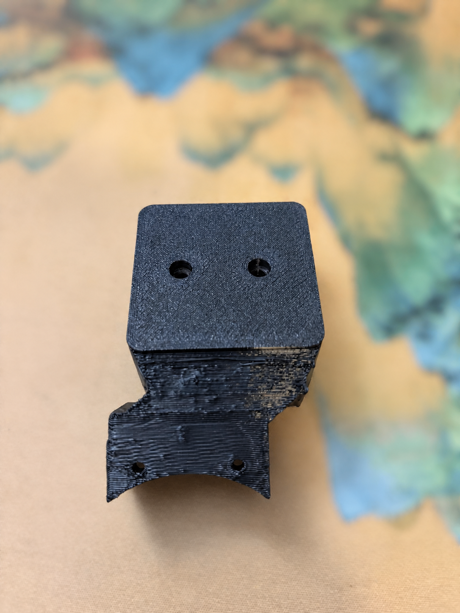
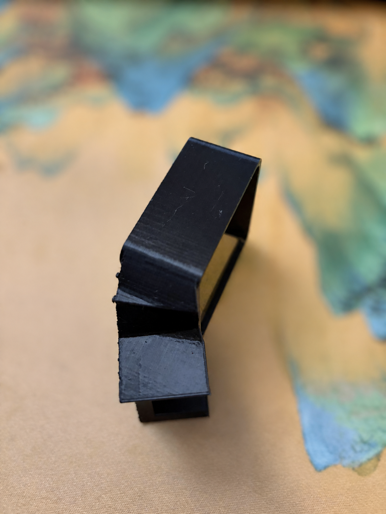
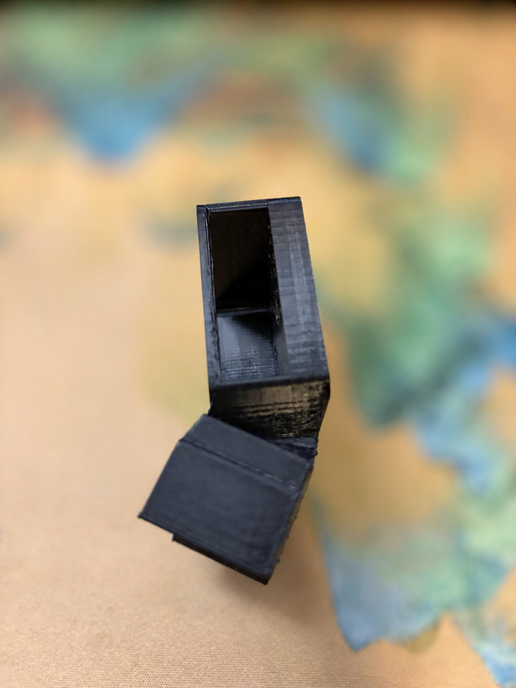
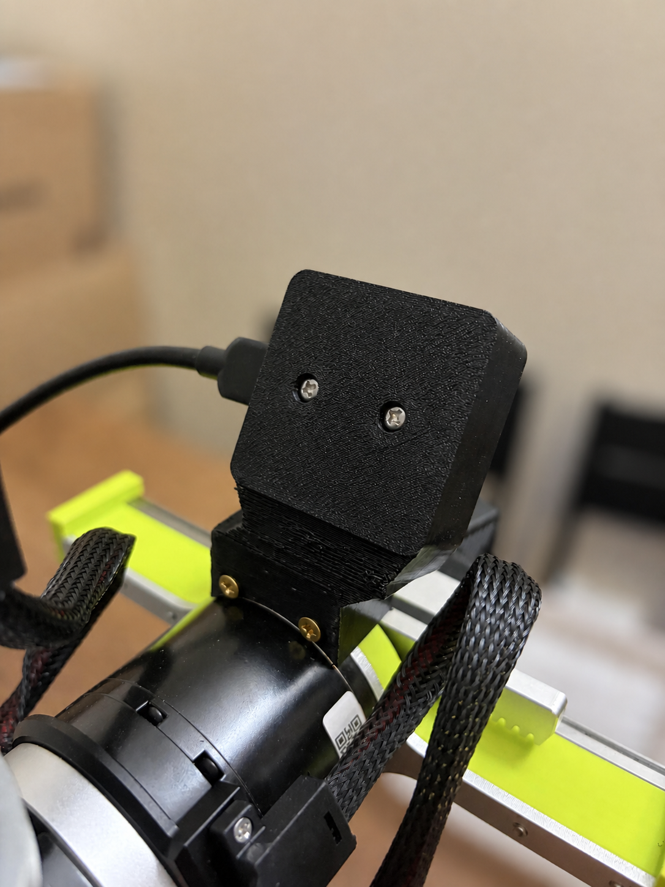
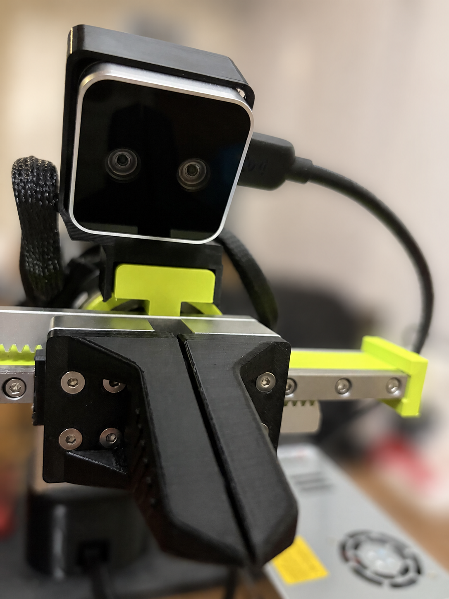
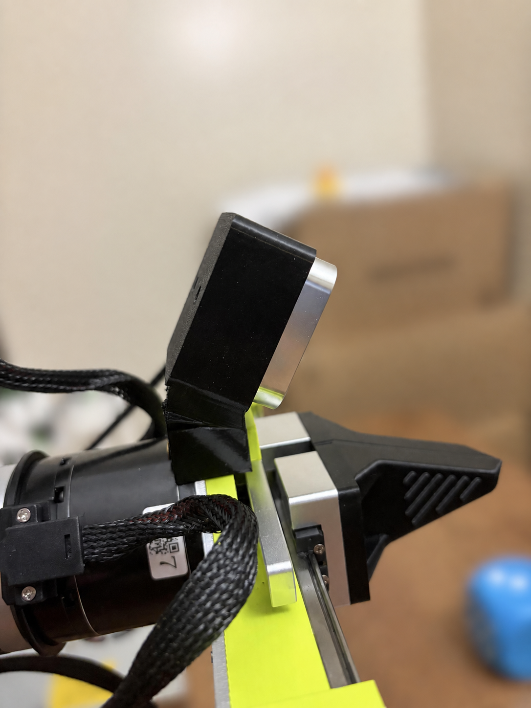
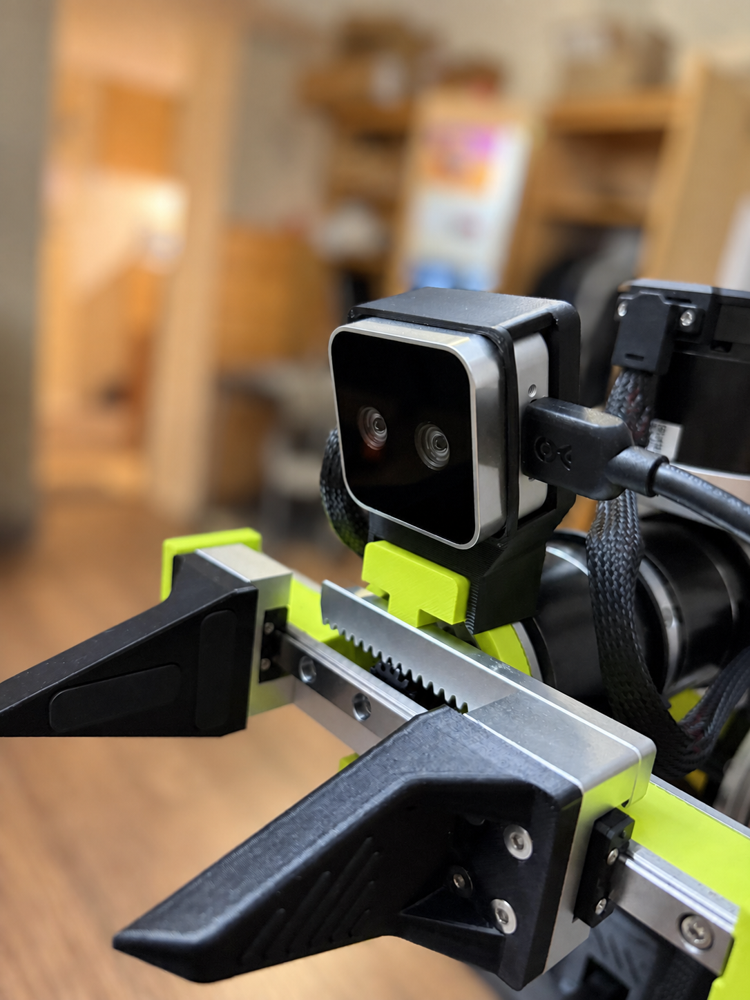
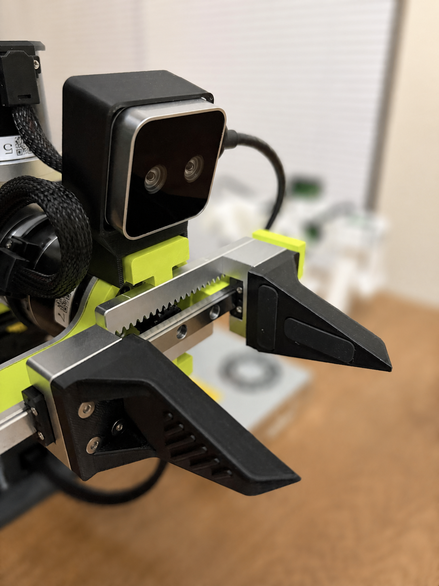
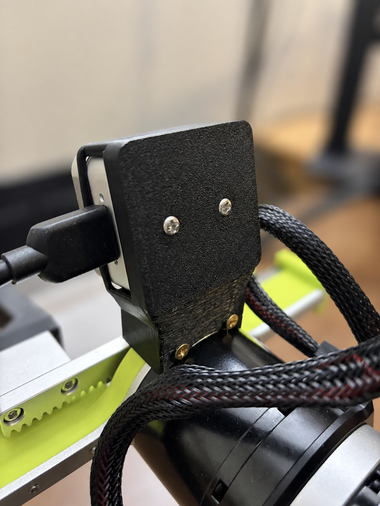
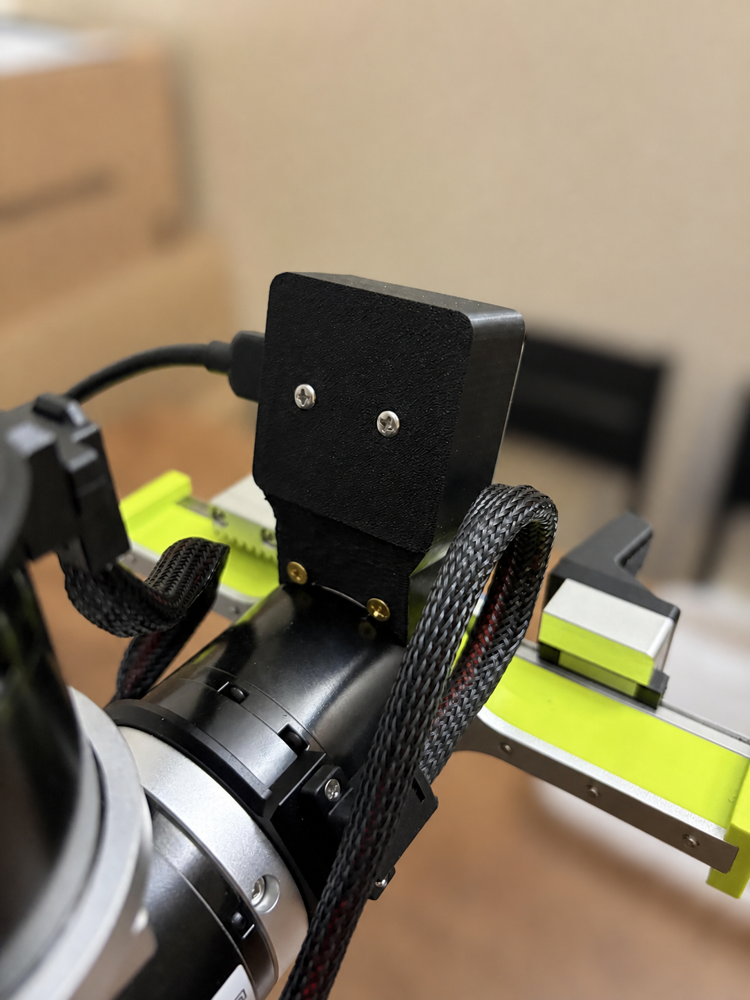

# Physical photo gallery / 真机实拍图库

All 16 physical photographs are included. These images document appearance and assembly only—use CAD and validation metadata for dimensional evidence.

全部16张实拍均已收入仓库。照片用于记录外观和装配；尺寸结论以CAD和验证元数据为准。

## Printed part / 打印件

| Rear / 背面 | Side / 侧面 |
| --- | --- |
|  |  |

| Camera cradle / 相机托架内部 | Opposite side / 另一侧 |
| --- | --- |
|  |  |

## Redesigned 30° mount installed / 改造30°安装效果

### Rear and screw views / 背面与螺丝

| Rear-left / 左后 | Rear-right / 右后 |
| --- | --- |
|  |  |

### Front and gripper relationship / 正面与夹爪关系

| Low front / 正面低视角 | Front-left / 左前 |
| --- | --- |
|  |  |

### Side pitch, USB and cable access / 侧面俯角、USB与线缆

| Right side / 右侧 | USB side wide / USB侧广角 |
| --- | --- |
|  |  |

## Seeed-derived stock mount reference / Seeed派生原版参考

These six images show the earlier stock-angle mount based on Seeed's pinned [`D405_305_Mount.step`](https://github.com/Seeed-Projects/reBot-DevArm/blob/590ff16c51099a15a34abb339c6364355fde9235/hardware/reBot_B601_DM/3D_Printed_Parts/D405_305_Mount.step) and must not be mistaken for the redesigned 30° installation.

以下六张是基于Seeed固定版本[`D405_305_Mount.step`](https://github.com/Seeed-Projects/reBot-DevArm/blob/590ff16c51099a15a34abb339c6364355fde9235/hardware/reBot_B601_DM/3D_Printed_Parts/D405_305_Mount.step)的较早原版角度mount，不能与30°改造安装混淆。

| Front-right / 右前 | Front / 正面 |
| --- | --- |
|  |  |

| Front wide / 正面广角 | Side-left / 左侧 |
| --- | --- |
|  |  |

| Rear / 背面 | Rear wide / 背面广角 |
| --- | --- |
|  |  |

Photo authorship: Bowen Zhu. Photographs are licensed under CC BY 4.0; see [LICENSE.md](../LICENSE.md).
