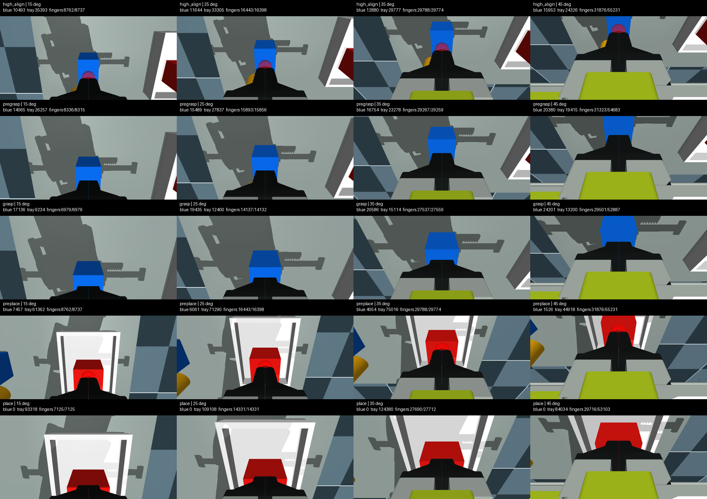

# MuJoCo 仿真复现

[English](simulation.md)

## 用途与边界

MuJoCo 用于回答第一阶问题：

- 完整 D405 包络相对绿色夹爪结构在哪里？
- 俯角如何改变近场可见性和夹爪遮挡？
- 在代理TCP目标上，30°设计是否仍位于7 cm理想近界之外？

它**不能**认证通电运动无碰撞、预测打印变形，也不能替代实测相机外参。

## 为什么没有把机器人模型复制进来

验证使用 [`ReBot_Arm_web_RS@d289fa7202ad7da9595a480b29397d70efacc4c1`](https://github.com/Yang-Ci/ReBot_Arm_web_RS/tree/d289fa7202ad7da9595a480b29397d70efacc4c1)。该commit没有仓库级许可证，因此这里不复制它的XML/URDF/mesh。用户需要单独clone并把仿真指向scene XML。

## 配置

在独立CAD环境生成测试角度mesh：

```bash
conda env create -f environment-cad.yml
conda activate rebot-d405-cad
python src/design_mount.py --angles 25 30 35
python src/validate_outputs.py --angles 25 30 35
```

获取固定版本机器人场景：

```bash
git clone https://github.com/Yang-Ci/ReBot_Arm_web_RS.git external/ReBot_Arm_web_RS
git -C external/ReBot_Arm_web_RS checkout d289fa7202ad7da9595a480b29397d70efacc4c1
```

新建**单独的** MuJoCo 环境，不要与 LeRobot 或 ROS 系统Python混用：

```bash
python3 -m venv .venv-sim
.venv-sim/bin/pip install -r requirements-simulation.txt
```

运行渲染对比和1°扫描：

```bash
export REBOT_MUJOCO_MODEL="$PWD/external/ReBot_Arm_web_RS/rebotarm_ros2/src/rebotarm_mujoco_rs/models/rs_grasp_scene.xml"
MUJOCO_GL=egl .venv-sim/bin/python simulation/simulate_fov.py
MUJOCO_GL=egl .venv-sim/bin/python simulation/sweep_angles.py
```

输出写入被忽略的 `build/`。

## 相机模型

- D405 包络：42 × 42 × 23 mm；视觉代理带圆角，碰撞检查额外使用尖角保守盒；
- 光学参考：左成像器，距离外壳/双目中点9 mm；
- 光学起点相对前玻璃：模型中3.7 mm；
- 实物640×480彩色垂直FOV：62.82°；
- 实物主点：约 `(323.24, 235.99)` 像素；
- MuJoCo 主点：居中，是明确记录的近似。

## 已发布输出

同一抓取姿态的受控synthetic RGB/Depth：


历史相机代理压力筛查（15°/25°/35°/45°；有意不加载可打印mount mesh）：




对应 CSV 位于 [`data/`](../data/)。仿真截图包含外部机器人项目的视觉资产，不在本仓库 CC BY 再许可范围内，详见 [LICENSE.md](../LICENSE.md)。
