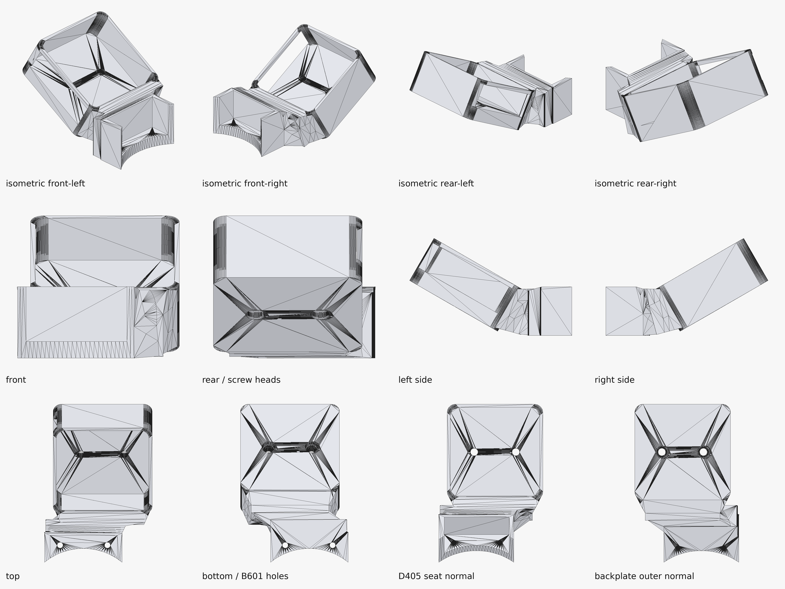
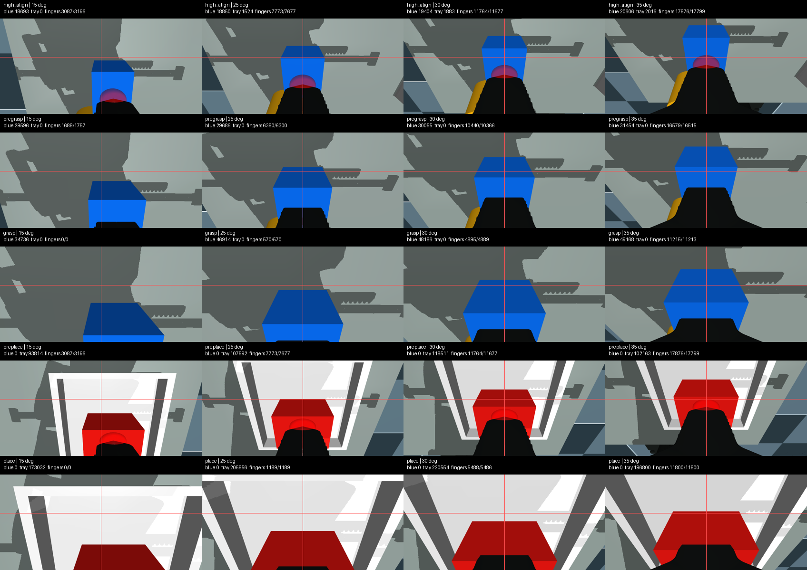

# Validation

[简体中文](validation.zh-CN.md)

## Validation layers

This project keeps four kinds of evidence separate. Passing one layer does not imply the next.

1. **CAD topology:** solid validity, holes, dimensions, inherited cradle equivalence.
2. **Mesh integrity:** connected, closed, manifold STL.
3. **MuJoCo screening:** first-order D405 envelope clearance, working distance, and rendered visibility.
4. **Physical acceptance:** print fit, screw assembly, USB access, and live camera framing.

## Automated CAD checks

`src/design_mount.py` and `src/validate_outputs.py` require:

- one valid STEP solid;
- one connected STL region;
- zero boundary and non-manifold STL edges;
- unblocked D405 and B601 screw passages;
- unchanged complete cradle geometry before rigid transformation;
- unchanged source handedness and correct USB opening side;
- substantial solid overlap between transition/base and transition/cradle;
- zero added adapter collision with the D405 engineering envelope;
- exact 20.000 mm D405 screw-axis spacing;
- metadata flags for the filled transition, shift, hole clearances, and no mirroring.

30° geometry results:

| Metric | Result |
| --- | ---: |
| STEP solids | 1 |
| STEP volume | ~32,475.6 mm³ |
| D405 screw-axis spacing | 20.000 mm |
| through/counterbore diameters | 3.6 / 6.0 mm |
| lateral cradle shift | −9.0 mm |
| Seeed source M3-pair offset | +1.000 mm |
| hole correction | −1.000 mm |
| source-hole fill volume | ~212.1 mm³ |
| new adapter–D405 collision | 0.0000 mm³ |
| adapter–base overlap | ~2,002 mm³ |
| adapter–cradle overlap | ~751 mm³ |



## MuJoCo screen

The local validation used [`ReBot_Arm_web_RS@d289fa7202ad7da9595a480b29397d70efacc4c1`](https://github.com/Yang-Ci/ReBot_Arm_web_RS/tree/d289fa7202ad7da9595a480b29397d70efacc4c1). The full-size D405 envelope and actual generated mount meshes were attached at the B601 screw-axis datum.

Conservative D405-to-green-part clearances:

| Pitch | Clearance |
| ---: | ---: |
| stock 15° | 9.17 mm |
| 25° | 11.17 mm |
| 29° | 9.53 mm |
| **30°** | **9.12 mm** |
| 35° | 7.06 mm |


The image below uses the physical camera's 640×480 calibration to compare wrist views at several tested pitches. The crosshair and task proxies support interpretation, but task-specific tray/cube pixels are not the angle selector.



Limitations:

- simplified rounded D405 housing, not manufacturing CAD for every chamfer;
- MuJoCo centered principal point, so small principal-point/lens-distortion residuals are omitted;
- scene and IK poses are screening proxies;
- mesh distance is not a tolerance stack-up or powered collision certificate.

## Physical print and installation

Two FDM material configurations were produced: PETG 100% infill and ABS 60% infill. The gallery includes the print and installation views.

Physical observations below apply to the manufactured and installed 30° design. That installation exposed the inherited 1 mm hole offset; the release incorporates the measured correction:

- the printed part is continuous across the filled transition;
- the D405 seats inside the inherited full cradle;
- both camera screws and both B601 interface screws assemble;
- USB-C remains accessible from the correct side;
- no mount material occludes the front imagers;
- the installed pitch and cradle clearance visually agree with the modeled orientation;
- a 640×480 D405 RGB frame placed the gripper centerline approximately at image center, supporting the 9 mm shift direction.

The corrected geometry passes the same CAD and MuJoCo checks, plus an export-level assertion that only the two corrected through/counterbore axes remain.


## Physical D405 output

The comparison below uses uncropped 640×480 frames output by the installed D405. The stock-mount source is an RGB frame extracted at 10.0 s from a 2026-08-24 recording. The redesigned-mount source is a synchronized RGB/depth capture from 2026-08-30 after 120 warm-up frames; depth was aligned to RGB and retained as a raw 16-bit PNG as well as a 0.04–0.50 m colorized view.


This supports the qualitative framing claim: the redesigned view centers the gripper and includes more of the near workspace. It does **not** establish a quantitative optical improvement because the dates, illumination, and robot poses were not controlled. Historical depth was not recorded. Exact source paths, timestamps, hashes, intrinsics, depth scale, and valid-pixel fraction are in [`data/physical_d405_capture_provenance.json`](../data/physical_d405_capture_provenance.json).

## Not yet claimed

- powered full-joint collision sweep;
- quantified vibration comparison between PETG and ABS;
- repeated remove/reinstall extrinsic repeatability;
- repeat-manufacturing measurement of corrected screw centering;
- 30-minute temperature logging at maximum stream load;
- metric RGB-D extrinsic calibration to the robot/tool frame.

These are future validation tasks, not silent assumptions.

## Reproduce

CAD:

```bash
conda env create -f environment-cad.yml
conda activate rebot-d405-cad
python src/design_mount.py --angles 25 29 30 35
python src/validate_outputs.py --angles 25 29 30 35
```

Fast repository integrity check:

```bash
python tools/check_repository.py
```

Optional read-only physical RGB-D capture (this opens only the named camera and does not connect to the robot or CAN):

```bash
python tools/capture_d405_rgbd.py --serial <D405_SERIAL> --output-dir capture-output
python tools/build_physical_camera_comparison.py \
  --redesigned-rgb capture-output/d405-rgb.png \
  --redesigned-depth-colorized capture-output/d405-depth-colorized.png \
  --output capture-output/d405-physical-output-comparison.png
```

The capture helper requires `pyrealsense2`, NumPy, and OpenCV. The comparison builder uses Pillow from `environment-cad.yml`.

MuJoCo reproduction is documented in [simulation.md](simulation.md). Machine-readable data are in [`data/`](../data/).
